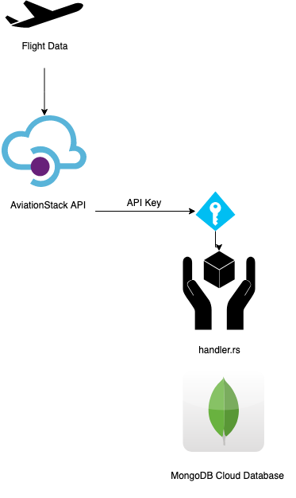

# live-avionics
Phased, real-time flight information Application

# Phase 1
The "real-time" component of this project is highly dependent on the availability of the public API offered by Aviation Stack. However, there is certainly a price barrier that prevents making over 100 calls (per month) feasible. Therefore, for `Phase 1`, we will simply provide the infrastructure that can be scaled based on the remaining number of requests for the given period

